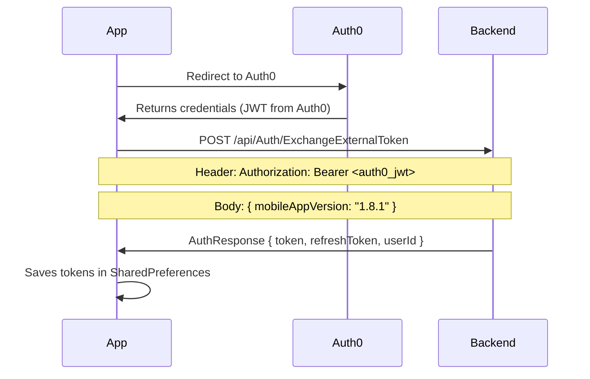
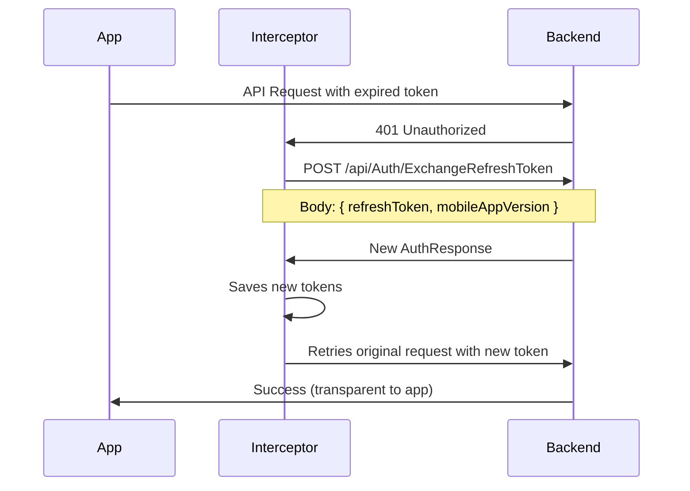

# Authentication System Documentation: Auth0 + Interceptors

## Architecture Overview

The application uses **Auth0** as the authentication provider and an **HTTP interceptor system** for automatic token management. The system is built on the **JWT (JSON Web Tokens)** pattern with a **refresh token** mechanism.

## 🔐 Authentication System Components

### 1. Auth0 Integration (`BaseAuth`)
**Location:** `lib/core/services/auth/base_auth.dart`

```dart
class BaseAuth {
  // Main authentication methods:
  - onStandardSignUp()     // Registration via form
  - onStandardSignin()     // Login via form  
  - onLoginGoogle()        // Google OAuth
  - onAppleSignIn()        // Apple Sign In (iOS)
  - logout()               // Logout
}
```

**Auth0 Configuration:**
- **Domain:** `dev-uoncfqz1w648mmdv.uk.auth0.com` (dev) / `trueme-space.uk.auth0.com` (prod)
- **Client ID:** Configured per environment
- **Audience:** API identifier for backend
- **Scheme:** `trueme://` (deep linking)

### 2. Token Management (`UserTokenRepository`)
**Location:** `lib/features/auth/data/user_token_repository.dart`

Manages tokens in **SharedPreferences**:
```dart
- getUserToken()         // Gets access token
- saveUserToken()        // Saves access token
- getRefreshToken()      // Gets refresh token  
- saveRefreshToken()     // Saves refresh token
- removeUserToken()      // Removes tokens (logout)
```

### 3. HTTP Interceptor (`CustomQueuedInterceptorsWrapper`)
**Location:** `lib/core/network/custom_queued_interceptors_wrapper.dart`

**Main functions:**
- Automatic addition of `Authorization: Bearer <token>` to requests
- Automatic refresh of expired tokens
- HTTP error handling (401, 403, 404, 5xx)
- Adding language headers (`X-Language-Context`)

## 🔄 Authentication Flow

### Login via Auth0:



### Automatic token refresh:



## 🛠 Backend Requirements

### Authentication Endpoints:

#### 1. `POST /api/Auth/ExchangeExternalToken`
**Purpose:** Exchange Auth0 JWT for application tokens

**Request:**
```json
Headers: {
  "Authorization": "Bearer <auth0_jwt>",
  "Content-Type": "application/json"
}

Body: {
  "mobileAppVersion": "1.8.1"
}
```

**Response (200):**
```json
{
  "token": "<access_token_jwt>",
  "refreshToken": "<refresh_token_jwt>",  
  "userId": "uuid"
}
```

#### 2. `POST /api/Auth/ExchangeRefreshToken`  
**Purpose:** Refresh expired access token

**Request:**
```json
{
  "refreshToken": "<refresh_token>",
  "mobileAppVersion": "1.8.1"
}
```

**Response (200):**
```json
{
  "token": "<new_access_token>",
  "refreshToken": "<new_refresh_token>",
  "userId": "uuid"
}
```

### JWT Token Structure:

**Access Token should contain:**
```json
{
  "UserId": "uuid",
  "ExternalUserId": "auth0|...",
  "MobileAppVersion": "1.8.1", 
  "exp": 1751050447,
  "iss": "https://dev.trueme.space",
  "aud": "https://access.api.dev.trueme.space"
}
```

**Refresh Token:**
```json
{
  "UserId": "uuid",
  "ExternalUserId": "auth0|...",
  "MobileAppVersion": "1.8.1",
  "exp": 1751651323,  // Longer TTL than access token
  "iss": "https://dev.trueme.space", 
  "aud": "https://refresh.api.dev.trueme.space"
}
```

## 🔧 HTTP Error Handling

### Status codes handled by interceptor:

- **401 Unauthorized:** Automatic token refresh
- **403 Forbidden:** 
  - `OutdatedAppVersion` → Force update  
  - Other → Logout user
- **404 Not Found:** Pass through to repository (not logged to Sentry)
- **400 Bad Request:** Log to Sentry
- **5xx Server Error:** Detailed backend error logging to Sentry

### Special headers:

```http
X-Language-Context: pl|en  # App language
Authorization: Bearer <jwt> # Automatically added (except ExchangeExternalToken)
```

## ⚠️ Important Notes for Backend Developer:

1. **Exception for ExchangeExternalToken:** This endpoint does NOT receive the automatic `Authorization` header with access token (because it doesn't exist yet)

2. **Token TTL:** Access token should have shorter TTL (e.g., 15 min), refresh token longer (e.g., 7 days)

3. **App version handling:** Backend checks `mobileAppVersion` and can return 403 with `detail: "OutdatedAppVersion"`

4. **Audience validation:** JWTs should have different `aud` for access and refresh tokens

5. **Auto-retry:** Interceptor automatically retries request after token refresh - backend doesn't need to do anything

6. **Logout flow:** When refresh token is invalid, app automatically logs out the user

This system ensures seamless user experience - the user doesn't see when tokens are being refreshed, everything happens transparently in the background.

## 📱 Mobile App Token Flow

### Initial Authentication:
1. User opens app → `SplashScreen` checks for `refreshToken`
2. If exists → Call `exchangeRefreshToken()`
3. If successful → Continue to main app
4. If failed → Redirect to login

### API Request Flow:
1. App makes API call
2. Interceptor automatically adds `Authorization: Bearer <token>`
3. If 401 response → Interceptor calls refresh endpoint
4. If refresh succeeds → Retry original request with new token
5. If refresh fails → Logout user and redirect to login

### Error Scenarios:
- **Network errors:** Logged to Sentry with context
- **Server errors (5xx):** Detailed backend exception logging
- **403 with version check:** Force app update
- **Refresh token expired:** Clean logout and fresh login required

## 🔍 Code References

### Key Files:
- **Auth0 Service:** `lib/core/services/auth/base_auth.dart`
- **Token Repository:** `lib/features/auth/data/user_token_repository.dart`
- **HTTP Interceptor:** `lib/core/network/custom_queued_interceptors_wrapper.dart`
- **Authentication Service:** `lib/features/auth/data/authentication_service/authentication_service_impl.dart`
- **Auth Repository:** `lib/features/auth/domain/authentication_repository/authentication_repository_impl.dart`

### Dependencies:
```yaml
auth0_flutter: ^1.2.1
dio: # HTTP client
injectable: # Dependency injection
```